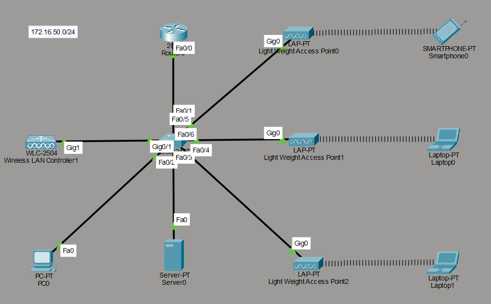

# Centralized Wireless Network with WLC and Lightweight Access Points

A Cisco Packet Tracer project simulating an enterprise wireless network using a centralized Wireless LAN Controller (WLC) architecture — where Lightweight Access Points register to and are managed entirely by a WLC via CAPWAP, rather than being configured individually.

 

---

## 📋 Project Overview

This project demonstrates a **controller-based wireless deployment**, the standard architecture used in enterprise networks (as opposed to standalone/autonomous APs, which are typically only used in small home or SOHO setups). A single Wireless LAN Controller centrally manages multiple Lightweight Access Points, pushing SSID, security, and RF configuration to all of them — eliminating the need to configure each AP individually.

**Key objective:** demonstrate WLC-to-AP registration via CAPWAP, centralized wireless management, and DHCP-based IP assignment for both wired and wireless clients on a single subnet.

---

## 🗺️ Network Topology


*Figure 1: WLC-based wireless network with three Lightweight Access Points serving wireless clients, alongside a wired PC and DHCP server.*

```
                          ┌────────────────┐
                          │   Router 2811  │
                          └───────┬────────┘
                                  │ Fa0/0
                                  │
                          ┌───────┴────────┐
                          │  Central Switch │
                          └┬──┬──┬──┬──┬───┘
                    Gig1   │  │  │  │  │  Fa0
              ┌────────────┘  │  │  │  └───────────┐
              │           Gig0│  │Gig0              │
        ┌─────┴─────┐   ┌────┴──┴───┐         ┌─────┴─────┐
        │ WLC-2504  │   │  LAP 0/1  │  ...    │ Server0   │
        │(Controller)│   │(Lightweight)│        │ (DHCP)    │
        └───────────┘   └─────┬─────┘         └───────────┘
                               │ (wireless)
                        Laptop / Smartphone
```

| Device                     | Model      | Role                                             |
|----------------------------|------------|---------------------------------------------------|
| Router                     | 2811       | Gateway for the 172.16.50.0/24 network             |
| Central Switch              | —          | Connects router, WLC, APs, server, and wired PC   |
| Wireless LAN Controller     | WLC-2504   | Centralized management of all Lightweight APs      |
| Light Weight Access Point ×3| LAP-PT     | Serve wireless clients; managed entirely by the WLC |
| Server0                     | Server-PT  | DHCP server for the subnet                         |
| PC0                          | PC-PT      | Wired client                                        |
| Laptop0 / Laptop1            | Laptop-PT  | Wireless clients                                    |
| Smartphone0                  | Smartphone-PT | Wireless client                                 |

---

## 🔢 IP Addressing

**Network:** 172.16.50.0/24

| Device            | IP Address     | Assignment Method   |
|--------------------|----------------|----------------------|
| WLC-2504            | 172.16.50.10   | Static (manual)      |
| Server0 (DHCP server)| —            | DHCP scope owner      |
| PC0                  | 172.16.50.14   | DHCP                  |
| Smartphone0          | 172.16.50.12   | DHCP                  |
| Laptop0              | 172.16.50.13   | DHCP                  |
| Laptop1              | 172.16.50.11   | DHCP                  |
| LAP0 client (via AP) | 172.16.50.17   | DHCP                  |
| LAP1 client (via AP) | 172.16.50.16   | DHCP                  |
| LAP2 client (via AP) | 172.16.50.15   | DHCP                  |

All addressing is on a single flat subnet — there is no VLAN segmentation or inter-VLAN routing in this project; the focus here is purely on wireless controller architecture.

---

## ⚙️ Configuration Approach

Unlike the VLAN/routing projects in this portfolio, **this project uses no CLI configuration**. Everything was configured through GUI:

1. **Router** — only the Fa0/0 interface was brought up (`no shutdown` via GUI) to provide connectivity to the LAN; no routing protocols or SVIs were needed since there's a single subnet.
2. **WLC-2504** — assigned a static management IP (172.16.50.10) and configured through its GUI to manage AP join, SSID broadcast, and wireless security settings.
3. **Lightweight Access Points** — required **zero individual configuration**. Each LAP discovers the WLC and joins it automatically over CAPWAP (Control and Provisioning of Wireless Access Points), then pulls its operating parameters (SSID, channel, security policy) from the controller.
4. **Server0** — configured via GUI as a DHCP server for the 172.16.50.0/24 pool, serving both wired and wireless clients.
5. **End devices** (PC, laptops, smartphone) — all set to DHCP; wireless clients additionally configured with the SSID broadcast by the WLC.

This mirrors real-world enterprise wireless deployments, where network administrators manage hundreds of APs from a single WLC dashboard instead of configuring each device by hand.

---

## ✅ Verification

- All three Lightweight APs successfully registered with the WLC over CAPWAP and appear as "up" in the WLC's AP list.
- All wired and wireless clients successfully received DHCP-assigned addresses within the 172.16.50.0/24 pool.
- Wireless clients (Smartphone0, Laptop0, Laptop1) connected to their respective APs and obtained network connectivity end-to-end (verified via ping to the DHCP server / router).

---

## 🎯 Skills Demonstrated

- Enterprise wireless network architecture (centralized WLC vs. autonomous APs)
- WLC-to-AP registration and management via CAPWAP
- GUI-based network device configuration (WLC, DHCP server)
- DHCP scope configuration and address assignment for mixed wired/wireless clients
- Understanding of Lightweight AP behavior in a controller-based deployment

---

## 📂 Files

| File          | Description                          |
|---------------|----------------------------------------|
| `WLC.pkt`     | Cisco Packet Tracer project file       |
| `README.md`   | This documentation                     |

---

## 🛠️ Tools Used

- Cisco Packet Tracer (v8.x)

---

## 📌 How to Open

1. Install [Cisco Packet Tracer](https://www.netacad.com/courses/packet-tracer) (free with a Cisco Networking Academy account).
2. Open the `.pkt` project file.
3. Click on each Lightweight AP to observe its CAPWAP association with the WLC-2504.
4. Click on a wireless end device to view its DHCP-assigned IP and confirm wireless association.
